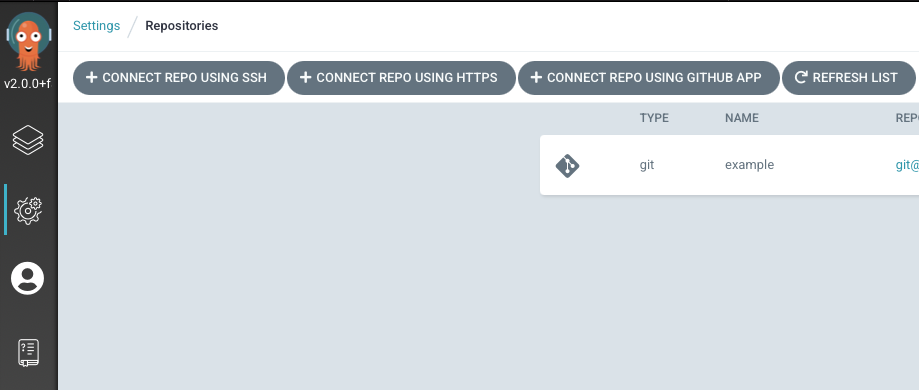
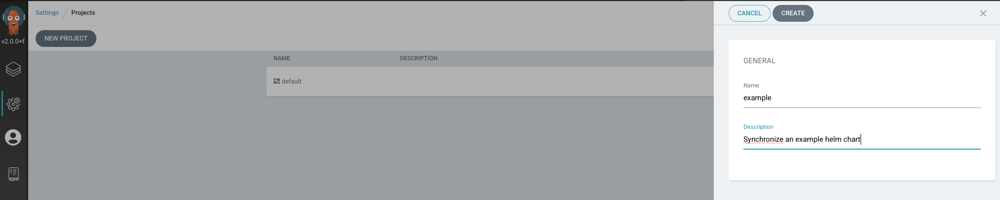
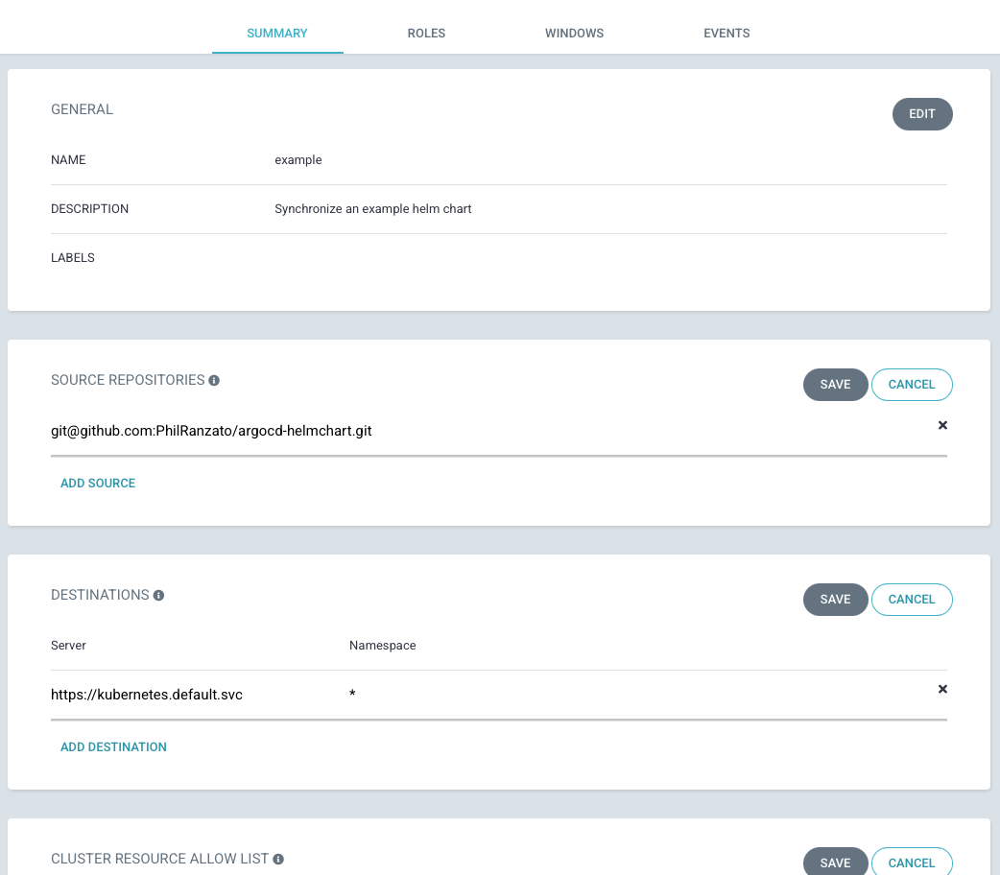
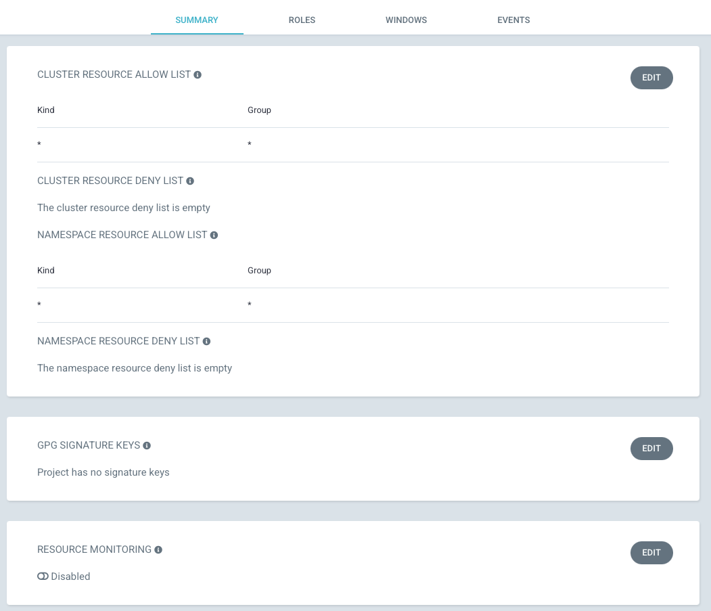
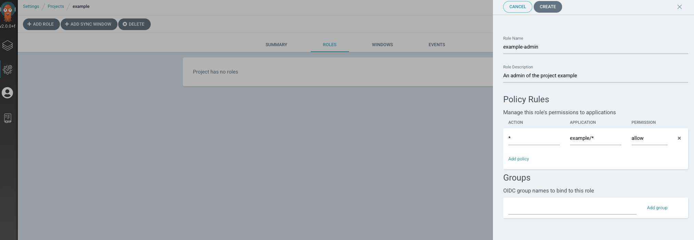
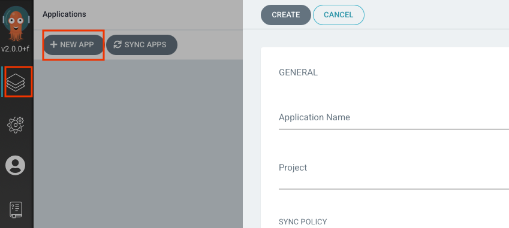
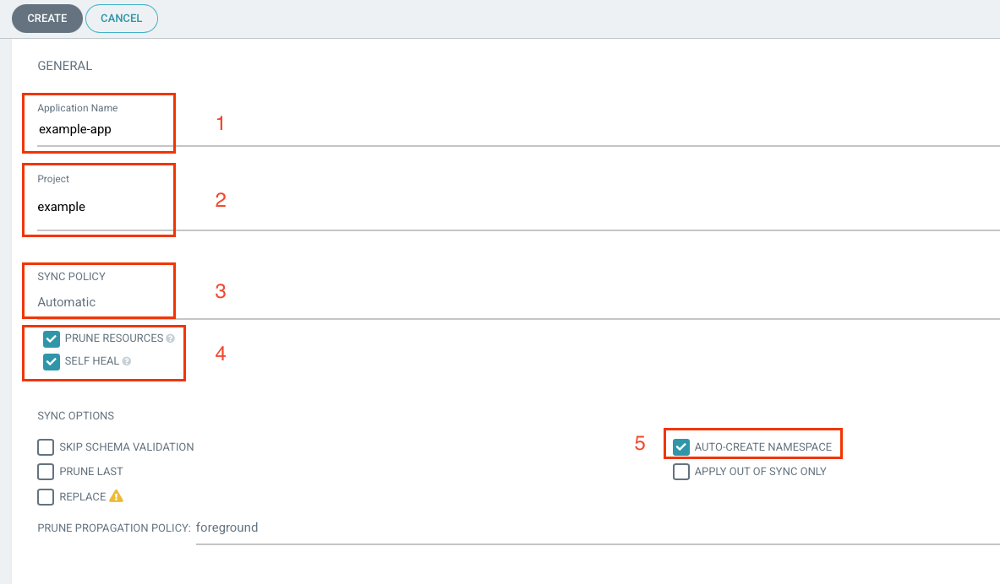
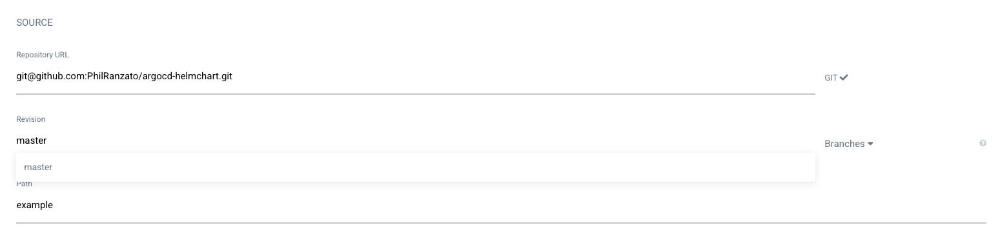
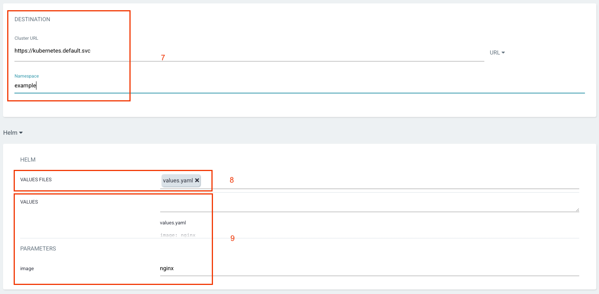
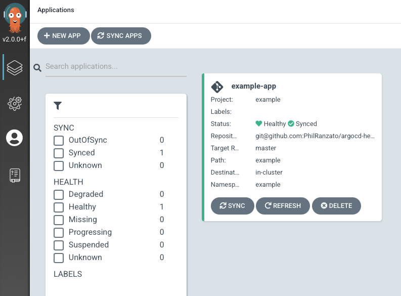

# argocd-helmchart
A repository to test ArgoCD with Helm

# Install ArgoCD

```shell
kubectl create namespace argocd
kubectl apply -n argocd -f https://raw.githubusercontent.com/argoproj/argo-cd/v2.0.0/manifests/install.yaml
```

## Get pwd

```shell
ARGO_PWD=$(kubectl -n argocd get secret argocd-initial-admin-secret -o jsonpath="{.data.password}" | base64 -d)
# Set in nodePort
kubectl patch svc argocd-server -n argocd -p '{"spec": { "type": "NodePort", "ports": [ { "nodePort": 31550, "port": 80, "protocol": "TCP", "targetPort": 8080 } ] } }'
argocd login --username admin --password $ARGO_PWD localhost:31550 --insecure
# argocd account update-password
```

# Configure a repository

Select the configuration menu and add a repositry in ssh



# Create a project

Select Projects in the configuration menu and create a project



# Configure a project

- Set the name
- Set the repository
- Set the cluster



- Allow cluster resources and namespace resources



# Create a role for the project

Select the Roles tab.

Remember to create the role **without policies**, then update it with the policy



# Create an Application

From the Manage application menu create a new app



## Configure the Application

1. Give the application a name
2. Select a project
3. Always nice to have an automatic sync
4. Prune resources and self-heal to have the **exact** state of Git
5. Auto-create namespace if you need it



6. Set the repository url, branch and path to the chart



7. Select the cluster and the namespace
8. Choose the `values.yaml` file for the helm chart
9. Customize parameters



# Application Created


